### Hi there, welcome to my GitHub profile 👋

- 🌱 I'm pursuing a PhD in Differential Ray Tracing for Radio Propagation, at UCLouvain, Belgium;
- :scroll: I have a [personal website](https://jeertmans.github.io),
  where I post about my research and sometimes other programming subjects. My research is fully open source and I currently
  work on a my own Differentiable Ray Tracing tool for Radio progragation:
  [DiffeRT](https://github.com/jeertmans/DiffeRT);
- 🔭 I maintain multiple open source projects incl. [Manim Slides](https://github.com/jeertmans/manim-slides),
  an extension to Manim for presenting contents using animations (e.g., I use it at conferences),
  and [LanguageTool-Rust](https://github.com/jeertmans/languagetool-rust), Rust bindings to the LanguageTool API;
- :crab: I recently fell in love with Rust and I am open to collaborate on Rust projects (*related or not to my research*);
- 🌟 With 2 friends, we developed, from 2019 to 2024, [ADE Scheduler](https://github.com/ADE-Scheduler/ADE-Scheduler),
  a web tool for students at UCLouvain. In September of 2024, it was adopted by
  UCLouvain as the official scheduling tool for the university and is now maintained by their teams.
- 📫 you can to reach me at jeertmans@icloud.com or jerome.eertmans@uclouvain.be (*research-only*).

Finally, I like to contribute to open source projects,
and you can find the list of my contribution to external projects
[here](https://github.com/search?q=author%3Ajeertmans+is%3Amerged+-org%3Ajeertmans+-org%3ALELEC210X+-org%3AUCLOUVAIN-CLUB-ELEC+-org%3AADE-Scheduler+-repo%3Aploum%2Flingi2401+&type=pullrequests).
