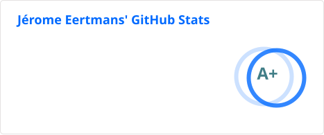

### Hi there 👋

I am a **postdoctoral researcher at UCLouvain, Belgium**, working on **radio propagation and differentiable ray tracing**. I completed my Ph.D. in July 2026; my thesis, *Differentiable Ray Tracing for Radio Propagation Modeling*, is available [here](https://hdl.handle.net/2078.5/278727).

I am the main developer of [**DiffeRT**](https://github.com/jeertmans/DiffeRT), an open-source differentiable ray tracing tool for radio propagation. I also maintain [**Manim Slides**](https://github.com/jeertmans/manim-slides) and [**LanguageTool-Rust**](https://github.com/jeertmans/languagetool-rust), among other projects.

From 2019 to 2024, I co-developed [**ADE Scheduler**](https://github.com/ADE-Scheduler/ADE-Scheduler), which was adopted by UCLouvain as its official scheduling tool in 2024.

You can find my publications on [Google Scholar](https://scholar.google.com/citations?user=YOUR_ID), more about my work on my [personal website](https://jeertmans.github.io), and my contributions to other open-source projects [here](https://github.com/search?q=author%3Ajeertmans+is%3Amerged+-org%3Ajeertmans+-org%3ALELEC210X+-org%3AUCLOUVAIN-CLUB-ELEC+-org%3AADE-Scheduler+-repo%3Aploum%2Flingi2401%5C&type=pullrequests).

📫 [jeertmans@icloud.com](mailto:jeertmans@icloud.com) · [jerome.eertmans@uclouvain.be](mailto:jerome.eertmans@uclouvain.be) *(research inquiries)*

  

